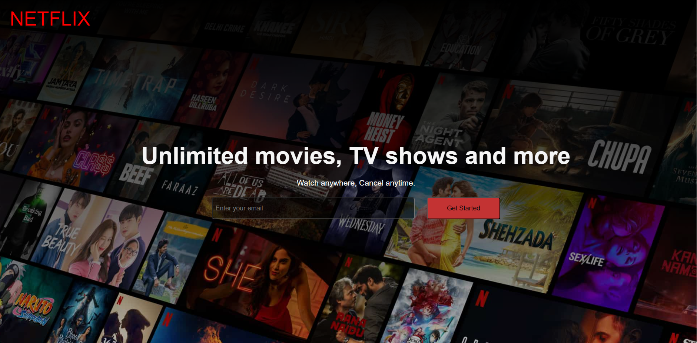

# Netflix Hero Section

This project aims to recreate the Netflix Hero Section using HTML and CSS. The Hero Section is the prominent and visually appealing part of the Netflix homepage, showcasing featured movies or TV shows.

## Project Overview

The goal of this project is to demonstrate the ability to recreate the Netflix Hero Section layout using HTML for the structure and CSS for styling. 

## Features

-- Responsive hero section layout, adapting to different screen sizes.
-- Background image and overlay to create a visually appealing effect.
-- Netflix logo and slogan placed on top of the hero image.
-- Call-to-action buttons for user interaction.
-- CSS animations or transitions to enhance the visual experience.

## Technologies Used

- HTML5 and CSS3
- Bootstrap framework (version XYZ)

## Contact

If you have any questions or suggestions, feel free to reach out. Thanks !